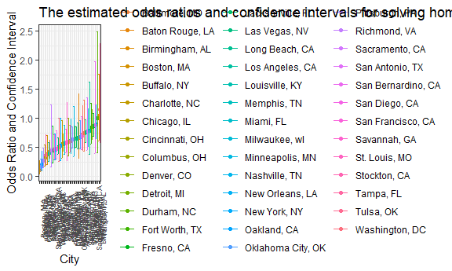
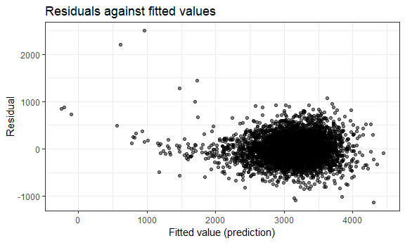

Data Science Homework 6
================
Boya Guo
11/27/2018

### Problem 1

``` r
homicide = read_csv(file = "./data/homicide-data.csv") %>% 
  janitor::clean_names() 
```

    ## Parsed with column specification:
    ## cols(
    ##   uid = col_character(),
    ##   reported_date = col_integer(),
    ##   victim_last = col_character(),
    ##   victim_first = col_character(),
    ##   victim_race = col_character(),
    ##   victim_age = col_character(),
    ##   victim_sex = col_character(),
    ##   city = col_character(),
    ##   state = col_character(),
    ##   lat = col_double(),
    ##   lon = col_double(),
    ##   disposition = col_character()
    ## )

First, we tidy the data, modifiy and change the variable names

``` r
homicide_1 = homicide %>% 
   mutate(victim_race = fct_relevel(ifelse(victim_race == "White", "white", "non-white"), "white"),
         victim_age = ifelse(victim_age == "Unknown", NA, as.integer(victim_age)),
         victim_sex = as.factor(victim_sex),
         city_state = paste(paste0(city, ","), state),
         resolved = as.numeric(disposition == "Closed by arrest")) %>% 
  filter(!city_state %in% c("Dallas, TX", "Phoenix, AZ", "Kansas City, MO", "Tulsa, AL")) %>% 
  select(uid, victim_race, victim_age, victim_sex, city_state, resolved)
```

    ## Warning in ifelse(victim_age == "Unknown", NA, as.integer(victim_age)):
    ## Ç¿ÖƸıä¹ý³ÌÖвúÉúÁËNA

Next we create a logistic regression model for Baltimore and save the output of glm as an R object

``` r
baltimore_logistic = homicide_1 %>%
  filter(city_state == "Baltimore, MD") %>% 
  glm(resolved ~ victim_age + victim_sex + victim_race, data = ., family = binomial()) 

save(baltimore_logistic,file = "baltimore_logistic.RData") 

baltimore_logistic
```

    ## 
    ## Call:  glm(formula = resolved ~ victim_age + victim_sex + victim_race, 
    ##     family = binomial(), data = .)
    ## 
    ## Coefficients:
    ##          (Intercept)            victim_age        victim_sexMale  
    ##              1.18603              -0.00699              -0.88779  
    ## victim_racenon-white  
    ##             -0.81960  
    ## 
    ## Degrees of Freedom: 2826 Total (i.e. Null);  2823 Residual
    ## Null Deviance:       3676 
    ## Residual Deviance: 3597  AIC: 3605

Then, we applied broom::tidy and obtain the estimate and CI for the adjusted OR

``` r
baltimore_logistic %>% 
  broom::tidy() %>% 
    mutate(OR = exp(estimate),
           conf_low = exp(estimate - 1.96*std.error),
           conf_high = exp(estimate + 1.96*std.error)) %>% 
    filter(term == "victim_racenon-white") %>% 
    select(term, OR, conf_low, conf_high) %>% 
    knitr::kable(digits = 4) 
```

| term                    |         OR|    conf\_low|                                                                                         conf\_high|
|:------------------------|----------:|------------:|--------------------------------------------------------------------------------------------------:|
| victim\_racenon-white   |     0.4406|       0.3129|                                                                                             0.6204|
| The OR estimate for sol |  ving homi|  cides compa|  ring non-white victims to white victims is 0.4406 and the true OR lies between 0.3129 and 0.6204.|

Next step, we run glm for each of the cities and extract the adjusted OR with CI

To do this, we create a logistic function and then perform the logistic regression on all cities

``` r
city_logistic = function(x){
    homicide_1 %>% 
    filter(city_state == x) %>% 
    glm(resolved ~ victim_age + victim_sex + victim_race, data = ., family = binomial())  %>% 
    broom::tidy() %>% 
    mutate(OR = exp(estimate),
           conf_low = exp(estimate - 1.96 * std.error),
           conf_high = exp(estimate + 1.96 * std.error)) %>% 
    filter(term == "victim_racenon-white") %>% 
    select(term, OR, conf_low, conf_high)
}

cities = 
  tibble(city_state = unique(homicide_1$city_state)) %>% 
  mutate(map(.x = unique(homicide_1$city_state), ~city_logistic(.x))) %>% 
  unnest

cities
```

    ## # A tibble: 47 x 5
    ##    city_state      term                    OR conf_low conf_high
    ##    <chr>           <chr>                <dbl>    <dbl>     <dbl>
    ##  1 Albuquerque, NM victim_racenon-white 0.741   0.451      1.22 
    ##  2 Atlanta, GA     victim_racenon-white 0.753   0.432      1.31 
    ##  3 Baltimore, MD   victim_racenon-white 0.441   0.313      0.620
    ##  4 Baton Rouge, LA victim_racenon-white 0.668   0.313      1.43 
    ##  5 Birmingham, AL  victim_racenon-white 1.04    0.615      1.76 
    ##  6 Boston, MA      victim_racenon-white 0.115   0.0472     0.278
    ##  7 Buffalo, NY     victim_racenon-white 0.390   0.213      0.715
    ##  8 Charlotte, NC   victim_racenon-white 0.558   0.321      0.969
    ##  9 Chicago, IL     victim_racenon-white 0.562   0.431      0.733
    ## 10 Cincinnati, OH  victim_racenon-white 0.318   0.184      0.551
    ## # ... with 37 more rows

Create a plot that shows the estimated ORs and CIs for each city

``` r
cities %>% 
  ggplot(aes(x = reorder(city_state, OR), y = OR, colour = city_state)) + 
  geom_point() +
  geom_errorbar(aes(ymin = conf_low, ymax = conf_high, width = 0.9)) +
  labs(
    title = "The estimated odds ratios and confidence intervals for solving homicides comparing non-white victims to white victims for each city",
    x = "City",
    y = "Odds Ratio and Confidence Interval"
    ) + 
  theme(legend.position = "right", axis.text.x = element_text(angle = 90, size = 7))
```

 According to the plot created, we found that the mean odds ratio of solving for a non-white victim case compared to white victime is less than 1. This suggests that the non-white victim cases are more likely to be unsolved. In addition, we found that Boston has the smallest OR, Tampa has the largest OR, and Durham has the largest CI.

### Problem 2

``` r
birthweight = read_csv(file = "./data/birthweight.csv") %>%
  janitor::clean_names()  
```

    ## Parsed with column specification:
    ## cols(
    ##   .default = col_integer(),
    ##   gaweeks = col_double(),
    ##   ppbmi = col_double(),
    ##   smoken = col_double()
    ## )

    ## See spec(...) for full column specifications.

``` r
birthweight %>% 
  janitor::clean_names() %>% 
  na.omit() %>% 
  mutate(babysex = as.factor(babysex),
         frace = as.factor(frace),
         malform = as.factor(malform),
         mrace = as.factor(mrace))
```

    ## # A tibble: 4,342 x 20
    ##    babysex bhead blength   bwt delwt fincome frace gaweeks malform menarche
    ##    <fct>   <int>   <int> <int> <int>   <int> <fct>   <dbl> <fct>      <int>
    ##  1 2          34      51  3629   177      35 1        39.9 0             13
    ##  2 1          34      48  3062   156      65 2        25.9 0             14
    ##  3 2          36      50  3345   148      85 1        39.9 0             12
    ##  4 1          34      52  3062   157      55 1        40   0             14
    ##  5 2          34      52  3374   156       5 1        41.6 0             13
    ##  6 1          33      52  3374   129      55 1        40.7 0             12
    ##  7 2          33      46  2523   126      96 2        40.3 0             14
    ##  8 2          33      49  2778   140       5 1        37.4 0             12
    ##  9 1          36      52  3515   146      85 1        40.3 0             11
    ## 10 1          33      50  3459   169      75 2        40.7 0             12
    ## # ... with 4,332 more rows, and 10 more variables: mheight <int>,
    ## #   momage <int>, mrace <fct>, parity <int>, pnumlbw <int>, pnumsga <int>,
    ## #   ppbmi <dbl>, ppwt <int>, smoken <dbl>, wtgain <int>

``` r
birthweight
```

    ## # A tibble: 4,342 x 20
    ##    babysex bhead blength   bwt delwt fincome frace gaweeks malform menarche
    ##      <int> <int>   <int> <int> <int>   <int> <int>   <dbl>   <int>    <int>
    ##  1       2    34      51  3629   177      35     1    39.9       0       13
    ##  2       1    34      48  3062   156      65     2    25.9       0       14
    ##  3       2    36      50  3345   148      85     1    39.9       0       12
    ##  4       1    34      52  3062   157      55     1    40         0       14
    ##  5       2    34      52  3374   156       5     1    41.6       0       13
    ##  6       1    33      52  3374   129      55     1    40.7       0       12
    ##  7       2    33      46  2523   126      96     2    40.3       0       14
    ##  8       2    33      49  2778   140       5     1    37.4       0       12
    ##  9       1    36      52  3515   146      85     1    40.3       0       11
    ## 10       1    33      50  3459   169      75     2    40.7       0       12
    ## # ... with 4,332 more rows, and 10 more variables: mheight <int>,
    ## #   momage <int>, mrace <int>, parity <int>, pnumlbw <int>, pnumsga <int>,
    ## #   ppbmi <dbl>, ppwt <int>, smoken <dbl>, wtgain <int>

There was no missing data in the dataset, and the distribution of the variables looks normal. However, all records of pnumlbw and variable pnumsga are 0.

Then we could use stepwise selection to select our models

``` r
full_model = lm(bwt ~ ., data = birthweight)

stepwise = step(full_model, direction = "both", trace = 0)
```

Then, we searched literature and tried to find which predictors we should include in our model

``` r
final_model = lm(bwt ~ babysex + bhead + blength + gaweeks + mheight + mrace + parity, data = birthweight)

summary(final_model)
```

    ## 
    ## Call:
    ## lm(formula = bwt ~ babysex + bhead + blength + gaweeks + mheight + 
    ##     mrace + parity, data = birthweight)
    ## 
    ## Residuals:
    ##      Min       1Q   Median       3Q      Max 
    ## -1129.95  -182.29    -6.22   178.82  2497.95 
    ## 
    ## Coefficients:
    ##              Estimate Std. Error t value Pr(>|t|)    
    ## (Intercept) -6604.402    138.959 -47.528  < 2e-16 ***
    ## babysex        33.640      8.695   3.869 0.000111 ***
    ## bhead         139.793      3.504  39.890  < 2e-16 ***
    ## blength        79.164      2.059  38.448  < 2e-16 ***
    ## gaweeks        13.090      1.497   8.745  < 2e-16 ***
    ## mheight         9.441      1.664   5.672  1.5e-08 ***
    ## mrace         -55.043      5.758  -9.559  < 2e-16 ***
    ## parity        102.807     41.548   2.474 0.013383 *  
    ## ---
    ## Signif. codes:  0 '***' 0.001 '**' 0.01 '*' 0.05 '.' 0.1 ' ' 1
    ## 
    ## Residual standard error: 280.7 on 4334 degrees of freedom
    ## Multiple R-squared:  0.7002, Adjusted R-squared:  0.6997 
    ## F-statistic:  1446 on 7 and 4334 DF,  p-value: < 2.2e-16

We included the sex of baby, baby’s head circumference at birth, baby’s length at birth, gestational age in weeks, mother’s height, mother’s race, and parity into our final regression model based on lit review.

Then we created a plot of model residuals against fitted values

``` r
birthweight %>% 
  add_residuals(final_model) %>% 
  add_predictions(final_model) %>% 
  ggplot(aes(x = pred, y = resid)) + 
  geom_point(alpha = 0.5) +
  labs(
     title = "Residuals against fitted values",
     x = "Fitted value (prediction)",
     y = "Residual"
   )
```

 According to the plot, we found that the residuals bounce randomly above and below the line residual = 0. The points roughly form a "horizontal band" around the line residual = 0. There were no obvious outliers in the plot. Therefore, We can assume that it met the criteria of a regression model.

Next, we compare your model to two others: One using length at birth and gestational age as predictors (main effects only); One using head circumference, length, sex, and all interactions

``` r
model1 = lm(bwt ~ blength + gaweeks, data = birthweight)
summary(model1)
```

    ## 
    ## Call:
    ## lm(formula = bwt ~ blength + gaweeks, data = birthweight)
    ## 
    ## Residuals:
    ##     Min      1Q  Median      3Q     Max 
    ## -1709.6  -215.4   -11.4   208.2  4188.8 
    ## 
    ## Coefficients:
    ##              Estimate Std. Error t value Pr(>|t|)    
    ## (Intercept) -4347.667     97.958  -44.38   <2e-16 ***
    ## blength       128.556      1.990   64.60   <2e-16 ***
    ## gaweeks        27.047      1.718   15.74   <2e-16 ***
    ## ---
    ## Signif. codes:  0 '***' 0.001 '**' 0.01 '*' 0.05 '.' 0.1 ' ' 1
    ## 
    ## Residual standard error: 333.2 on 4339 degrees of freedom
    ## Multiple R-squared:  0.5769, Adjusted R-squared:  0.5767 
    ## F-statistic:  2958 on 2 and 4339 DF,  p-value: < 2.2e-16

``` r
model2 = lm(bwt ~ bhead + blength + babysex + bhead*babysex + bhead*blength + blength*babysex + bhead*babysex*blength, data = birthweight)
summary(model1)
```

    ## 
    ## Call:
    ## lm(formula = bwt ~ blength + gaweeks, data = birthweight)
    ## 
    ## Residuals:
    ##     Min      1Q  Median      3Q     Max 
    ## -1709.6  -215.4   -11.4   208.2  4188.8 
    ## 
    ## Coefficients:
    ##              Estimate Std. Error t value Pr(>|t|)    
    ## (Intercept) -4347.667     97.958  -44.38   <2e-16 ***
    ## blength       128.556      1.990   64.60   <2e-16 ***
    ## gaweeks        27.047      1.718   15.74   <2e-16 ***
    ## ---
    ## Signif. codes:  0 '***' 0.001 '**' 0.01 '*' 0.05 '.' 0.1 ' ' 1
    ## 
    ## Residual standard error: 333.2 on 4339 degrees of freedom
    ## Multiple R-squared:  0.5769, Adjusted R-squared:  0.5767 
    ## F-statistic:  2958 on 2 and 4339 DF,  p-value: < 2.2e-16

Then, we calculated RMSE for the three models

``` r
cv = birthweight %>% 
  crossv_mc(100)

cv_bw = cv %>% 
   mutate(
     final_model =  map(train, ~lm(bwt ~ babysex + bhead + blength + gaweeks + mheight + mrace + parity, data = birthweight)),
     model1 = map(train, ~lm(bwt ~ blength + gaweeks, data = .)),
     model2 = map(train, ~lm(bwt ~ bhead + blength + babysex + bhead*babysex + bhead*blength + blength*babysex + bhead*babysex*blength, data = .))) %>% 
   mutate(rmse_final_model = map2_dbl(final_model, test, ~rmse(.x, .y)),
         rmse_model1 = map2_dbl(model1, test, ~rmse(.x, .y)),
         rmse_model2 = map2_dbl(model2, test, ~rmse(.x, .y)))
```

We could visulize this by plotting violin plots

``` r
cv_bw %>% 
  select(starts_with("rmse")) %>% 
  gather(key = model, value = rmse) %>% 
  mutate(model = str_replace(model, "rmse_", ""),
         model = fct_inorder(model)) %>% 
  ggplot(aes(x = model, y = rmse)) + geom_violin() + 
  labs(
    title = "Comparison of the Three Models Using Violin Plots",
    x = "Model",
    y = "RMSE")
```

 From our plots, we could see that our final model has a smaller RMSE, indicating a more fitted regression model. Therefore, I would use the final model for this study. More tests are still needed to derive a more fitted model.
